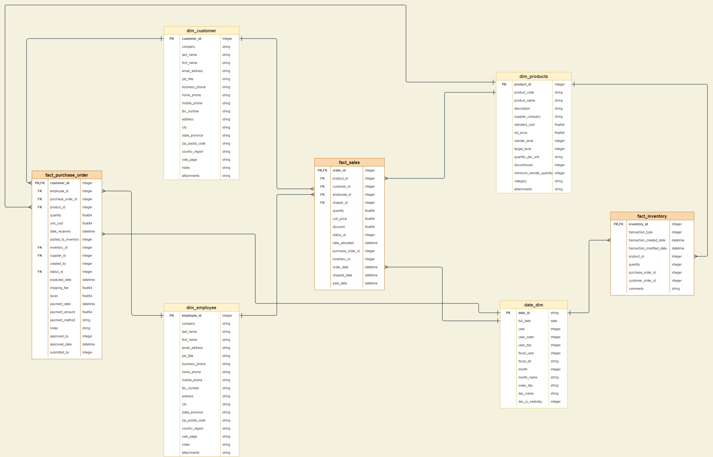
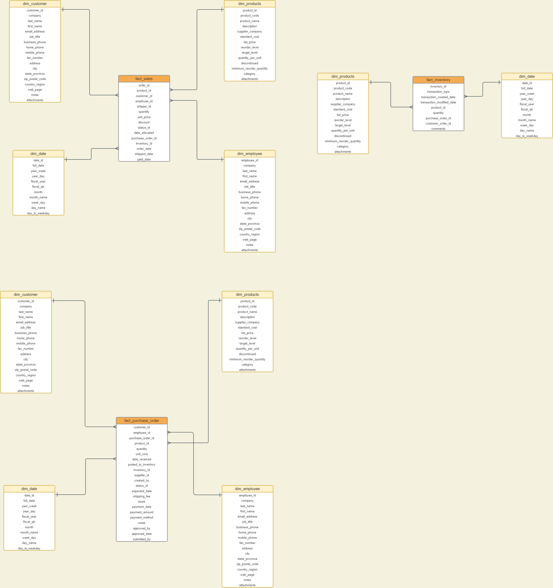
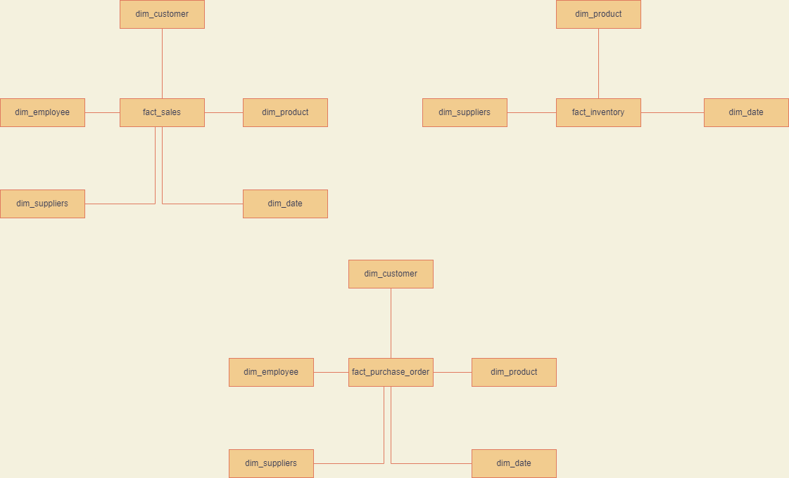

# Northwind Analytics based on BigQuery, Dataform & Data Studio

The Northwind database is a sample database created by Microsoft to demonstrate the features of some of its products and for training and tutorial purposes.

The database contains all the sales data for Northwind Traders, a fictitious specialty foods export-import company.
* Sales transactions between the company(Northwind Traders) and its customers.
* The purchase transactions between Northwind and its suppliers.

## User Case
* Northwind Traders are export import company who trades around the world for speciality foods.
* Their existing architecture is mostly a mix of on-premise & legacy systems, including their MySQL database which is primary operational database.
* This is where all the sales transactions are recorded between company and it's customers.
* Same MySQL database is also being used to generate reports & build analytics solutions.
* They are struggling to keep up with reporting requirements and causing database to slow down impacting their day to day business.
* Nortwind traders want to modernise their data & reporting solutions and move away from on-premise solution slowly.
* They want to modernise their existing infrastructure for:
    * Better scalability
    * Reduce load on operational systems
    * Improved reporting speed
    * Improved data security
* Northwind Traders will migrate their existing database system to Google Cloud Platform.
* MySQL on-premise will be replaced with a fully managed Cloud SQL for MySQL.
* During this migration they need help with setting up OLAP system for reports.
* BigQuery was selected to run OLAP.
* Need to build high priority reports first to access new system and drive adoption.
* Dimensional data warehouse will be built on BigQuery to support with reporting requirements.

## Requirement Gathering
* Define business processes.
    * **Sales overview**: Overall sales reports to understand better our customers what is being sold, what sells the most where and what sales the least, the goal is to have a general overview of how the business is going.
    * **Sales agent tracking**: Tracking sales and performance of each sales agent to adjust commissions, reward high achiever and empower low achievers.
    * **Product inventory**: Understand the current inventory levels, how to improve stock management, what suppliers we have, how much is being purchased. This will allow to understand stock management and potentially broker better deals with suppliers.
    * **Customer reporting**: Allow customers to understand their purchase orders, how much and when are they buying, empowering them to make data driven decisions nad utilize the data to join to their sales data.
* Conduct data profiling.
* Create bus matrix high level entities.
* Create naming conversion document.
* Create conceptual model.

## Data Profiling
Existing tables in OLTP system:
* **customer**: Cusotmers buy food from Northwind.
* **employees**: Works for Northwind.
* **orders**: Sales Order transactions taking place between the customers & Northwind.
* **order_details**: Order details for the orders placed by cusotmers.
* **inventory_transactions**: Transaction details of each inventory.
* **products**: Contains current Northwind products that customers can purchase.
* **shippers**: Ships orders from Northwind to customers.
* **suppliers**: Supply Northwind with required items.
* **invoices**: Invoice created for each other.

## Architecture Design
The following is the high level entities bus matrix after the requirement gathering.
| Business Process   | product | orders | employees | customers | suppliers | date |
| ------------------ | ------- | ------ | --------- | --------- | --------- | ---- |
| Sales overview     | ✓       | ✓      | ✓         | ✓         | ✓         | ✓    |
| Sales agents       | ✓       | ✓      | ✓         | ✓         | ✓         | ✓    |
| Product inventory  | ✓       | ✓      |           |           | ✓         | ✓    |
| Customer reporting | ✓       | ✓      | ✓         | ✓         | ✓         | ✓    |

## Northwind Database Creation
To build the database and tables, we used the northwind_oltp_bq_schema(create-tables-script).sql and nortwind_oltp_data(insert-data-script).sql in /includes to create the database tables and populate the records in each table.

## ER Diagram for Physical, Logical and Analytical Layers
For an easy development and implementation, we placed all the physical, logical, analytical layer, along with the production envrironment in a single dataset named Northwind, each with different prefix.
* Physical layer:

* Logical layer:

* Analytical layer:

Finanly it turned out to only 3 one-big-wide tables for all 4 analytical reports because in obt_sales_overview there is enough information to do both Sales overview and Sales agents business processes, while the other two one-big-wide tables (obt_customer_reporting and obt_product_inventory) can be worked for Customer reporting and Product inventory respectively.